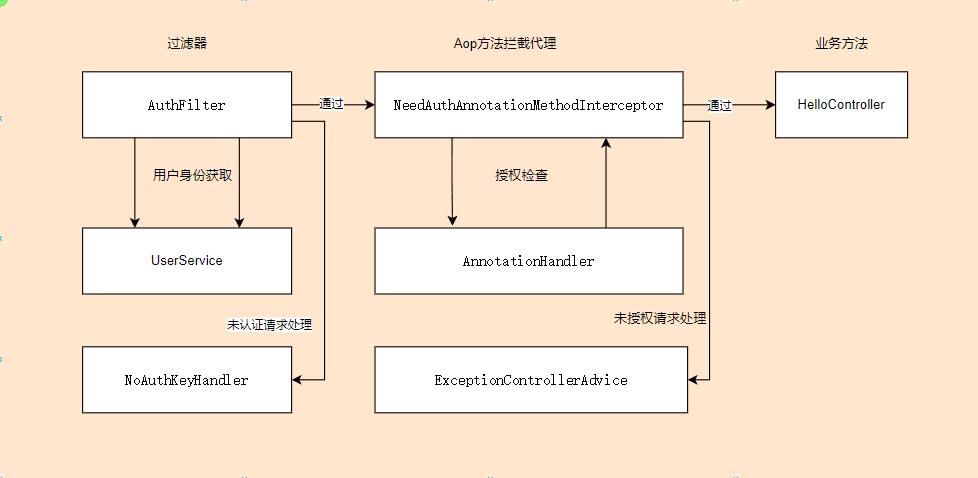

# Easy Auth

超小的Spring Auth认证鉴权框架，是shiro的mini版本，只保留最核心的认证和授权功能，更适合中小项目中前后端分离的认证和授权模式，非常容易上手，非常利于改造和适配到您的项目中。

## 特性

- 简化认证流程、超精炼用户信息
- 开箱即用从请求参数、请求头、Cookie中获取凭据信息，支持自定义逻辑获取凭据信息
- 开箱即用路径白名单，支持自定义白名单逻辑
- 方法级别授权检查注解`@NeedAuth`,`@NeedRole`,`@NeedPerm`
- 支持自定义授权注解处理器（超容易！）
- 支持自定义认证失败逻辑
- 支持自定义授权失败逻辑

## 架构



## 起步

1. 直接在pom.xml中引用,现在你的项目已经被保护起来了！

```xml

<dependency>
    <groupId>com.edfeff</groupId>
    <artifactId>easy-auth-spring-boot-starter</artifactId>
    <version>0.0.1</version>
</dependency>
```

如果没有添加spring-boot-starter-web则需要添加下面的依赖

```xml

<dependency>
    <groupId>org.springframework.boot</groupId>
    <artifactId>spring-boot-starter-web</artifactId>
    <version>2.7.0</version>
</dependency>
```

2. 实现自定义UserService,（默认提供了一个匿名用户服务，只能测试使用）

```java

@SpringBootApplication
public class MyAopApplication {
    @Component
    public class MyInMemoryUserService implements UserService {
        public Map<String, User> userMap = new HashMap<String, User>() {
            {
                put("admin", new User("admin",
                        Collections.singleton("admin"),
                        Arrays.asList("user:read", "user:delete", "user:update", "user:create")
                ));
                put("user", new User("user",
                        Collections.singleton("user"),
                        Arrays.asList("user:read")
                ));
            }
        };

        @Override
        public User getFromToken(String token) {
            return userMap.getOrDefault(token, User.Anon);
        }
    }

    public static void main(String[] args) {
        SpringApplication.run(MyAopApplication.class, args);
    }
}
```

5. 在保护的方法上添加注解`@NeedAuth`,`@NeedRole`,`@NeedPerm`

```java

@RestController
@RequestMapping("/auth")
public class TestHelloController {
    @NeedRole("admin")
    @GetMapping("/admin")
    public String admin() {
        return "admin";
    }

    @NeedRole("user")
    @GetMapping("/user")
    public String user() {
        return "user";
    }


    @NeedPerm("user:delete")
    @GetMapping("/delete")
    public String delete() {
        return "delete";
    }

    @NeedPerm("user:create")
    @GetMapping("/create")
    public String create() {
        return "create";
    }

    @NeedPerm("user:read")
    @GetMapping("/read")
    public String read() {
        return "read";
    }
}
```

## 其他说明

### 自定义注解